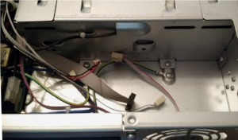
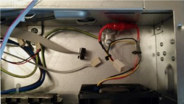
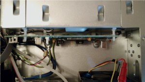
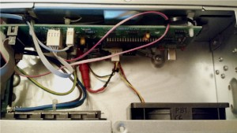
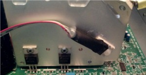
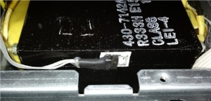
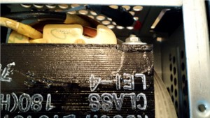
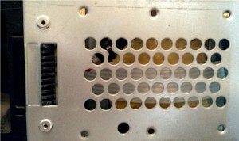
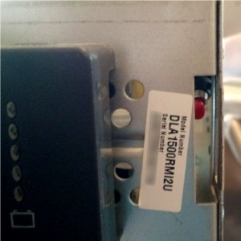

# Smart UPS addon

This directory contains a Smart UPS addon.

In its current form it contains a temperature controller which:
* has multi-point temperature sensing,

* has two-speed (plus a fan-disabled mode) fan controller with fan failure monitoring,

* supports data readout (temperature, fan speed) via the UPS built-in UPS-Link serial port
  (replacing the *y* rarely used protocol command which normally shows just a copyright notice),

* fits inside the UPS proper, leaving the UPS SmartSlot expansion bay free for other uses
  (and so shouldn't cause problems for SmartSlot peripherals),

* follows a careful fail-safe design rules to make sure that start-up or in-operation transients do not result in unsafe outputs,

* utilizes a hardware always-on watchdog and brownout detector protection,
  with the boot loader flash memory section hardware-protected against an accidental overwrite,

* supports safe in-field firmware update via the UPS built-in serial port (no opening of the UPS is necessary),

* uses compiler barriers and interrupt disabling "atomic blocks" where necessary to avoid declaring variables shared with interrupt handlers as volatile,

* has a large hardware potential for extra functionality implementable via just a firmware update.

The addon has a complete control of the UPS built-in UPS-Link serial port so it could also be used for things like:
* adding new serial commands,

* modifying responses of existing commands, or even:

* implementing a completely different serial protocol.

Schematic is available [here](https://gist.github.com/maciejsszmigiero/5108ef7595f59726d89982dca7919506#file-smartupsaddon-pdf) and
PCB Gerber files are available [here](https://gist.github.com/maciejsszmigiero/5108ef7595f59726d89982dca7919506#file-smartupsaddon_pcb-zip).

The PCB has been designed to fit inside SUAxx00RMI2U models (for mounting on the back wall of the battery compartment with one PCB sensor directly measuring battery temperature).

## Compiling the bootloader

You'll need to get *stk500v2-bootloader* from Jörg Desch repository located [here](https://github.com/joede/stk500v2-bootloader/tree/develop) (*develop* branch):
```sh
git clone -b develop 'https://github.com/joede/stk500v2-bootloader.git'
```

Let's assume that you had checked out *stk500v2-bootloader* to */home/user/git/stk500v2-bootloader* directory.
Then you can go to *bootloader* subdirectory of this addon and issue the following command to compile the bootloader:
```sh
make SRCDIR="/home/user/git/stk500v2-bootloader"
```

The bootloader will be built to a file named *stk500boot.hex*.

## Programming the bootloader

Program the *stk500boot.hex* file into the µC using your favourite programmer (either via AVR-ISP *J3* connector or directly into the chip).

When programming the bootloader you'll also need to program fuse and lock bits right - see the next section
how to get the correct values for them.

## Compiling the firmware

Take a look at the *build.base* file. There are various debug defines at its top.
For release code you don't need to uncomment any of them, but if you would like to enable some debug feature then first copy the *build.base* file to a file named *build*,
then make adjustments only in this file, so your local changes won't clash with future changes to *build.base*.

Now you can build the code by typing:
```sh
./build.base
```
or (if you had adjusted the build defines):
```sh
./build
```

The firmware will be built to a file named *smartupsaddon.hex*.

## Programming the firmware

The firmware can be programmed after the addon is mounted inside the UPS via the UPS built-in serial port.

In order to do so:
1. Press and hold the button connected to the *J6* connector for about 5 seconds.
   This will reset the µC and then (when the button is finally released) make the addon enter the bootloader.
   If the fan was not in the highest speed setting before you'll hear it switch to this (fallback) setting.

1. Use *avrdude* to write the firmware file *smartupsaddon.hex* via the bootloader (use programmer type *stk500v2*, speed 115200 bps).
   Example *avrdude* invocation:
   ```sh
   avrdude -p m1284 -c stk500v2 -P /dev/ttyUSB0 -U flash:w:smartupsaddon.hex:i
   ```

1. When *avrdude* finally exits it should terminate the bootloader, so the main firmware will begin executing automatically.

### Extracting fuse and lock bits from the firmware file

After a successful firmware build an ELF file named *smartupsaddon.elf* will be present.

You can extract fuse and lock bits from this file by typing:
```sh
avr-objdump -s -j .fuse -j .lock smartupsaddon.elf
```

The output will be similar to:
```
Contents of section .fuse:
820000 d7c4fd
Contents of section .lock:
830000 ef
```

This means that low, high and extended fuse bytes have values of 0xd7, 0xc4, 0xfd, respectively,
and the lock bits byte has value of 0xef (but verify this yourself!).

## Assembling

The BOM with [TME](https://tme.eu/) part numbers is available [here](https://gist.github.com/maciejsszmigiero/5108ef7595f59726d89982dca7919506#file-bom-txt).
When using a different supplier the part list will probably need some adaptation.

By default there are three TC74 sensors defined in the code:
1. TC74A0-5.0VAT to be mounted directly on the PCB (on the solder side), measuring battery temperature,

1. TC74A3-5.0VAT to be mounted on the UPS inverter transistors heatsink,

1. TC74A7-5.0VAT to be mounted on the UPS main transformer (with temperature limits raised by 20 °C).

You can adjust sensor count, their addresses and offsets of temperature limits in the temp.c file.

*U8* should be a 24 volts to 12 volts DC / DC converter with 7812 (TO-220 package)-compatible pinout (it could be even an actual 7812, perhaps with an output capacitor and a small heatsink).

## Mounting in an UPS

### <a name="pcb-attaching"></a>Attaching the PCB

The PCB should be mounted on the back wall of the battery compartment using ~10 mm spacers, which clip into horizontal slots with rounded ends located on the top of this wall.
Additionally, a ~10 mm PCB support should be inserted in the PCB hole near *D1* cathode.

#### Photos:

Recommended installation place:
[](docs/img/install-0.jpg)
[](docs/img/install-1.jpg)

The addon mounted...:
[](docs/img/install-2.jpg)

...and connected:
[](docs/img/install-3.jpg)

### Fan supply voltage

You'll need a 24 volt supply for the fan (*J4* connector).

You can get it from the UPS's original fan connector after either shorting emitter to collector leads of one of the fan switching transistors
(the fan transistors are likely called *Q42* or *Q44* on the UPS mainboard) or
by taking only the 24 volt positive rail from this connector and the ground rail from some another point or connector (where it is permanently present).

### Fan connection

A fan with a tachometer output (a "three wire" fan) is needed for fan RPM monitoring.
This is nearly the same type as is commonly used for PC cooling - but with 24-volt voltage rating.

Additionally, the addon uses the same fan connector type with the same pinout as PC fans use -
this means that a PC fan of suitable dimensions and voltage rating can be used directly without needing to rewire it first.
It is recommended, however to add a fuse on the positive fan wire (for example a 250mA fast blow type) to protect against a short circuit in the fan.

Fan dimensions are 80 mm x 80 mm x 25 mm.
One example of a compatible fan model is SUNON ME80252V1-000-G99.

See photos in the *[Attaching the PCB](#pcb-attaching)* section for an example of a fan connection.

### SmartSlot ribbon cable

Disconnect the existing SmartSlot flat ribbon cable from the UPS mainboard and connect it to the *J2* connector on the addon.

Make a 1:1 14-conductor flat ribbon cable with IDC connectors (2 rows x 7 pins) at both ends and connect it between the UPS mainboard
(to the socket where the SmartSlot flat ribbon cable was originally connected) and the *J1* connector on the addon.

### Sensors

#### Battery temperature

The first (battery temperature) sensor in mounted directly on the PCB.
This sensor should be wrapped in an insulating cover (possibly secured by a cable tie) and its leads bent so they press it firmly against
the back wall of the battery compartment, this way maintaining a sensible thermal contact.

#### Inverter heatsink

The second sensor should be mounted on the UPS inverter transistors heatsink.

This heatsink in fact comprises four separate heatsinks close to each other and isolated electrically.
Since they are located so close together and their transistors should have the same duty cycle it can be assumed that
their temperatures will also be very close, so installing the sensor on just one of them is enough.

In fact, some SUAxx00RMI2U models have a thermistor for extra protection of the switching transistors which is
similarly attached to only one of the heatsinks.

There is a hole in one corner of the first (counting from the UPS front) heatsink which can be utilized for mounting a TO-220-packaged sensor.
An M3-thread screw will fit easily in this hole.

Note, however, that there have to be good electrical insulation between heatsink surface and the sensor.
Use an insulating pad with good thermal conductivity and secure the sensor using a plastic screw.

Sometimes (especially when the UPS is charging its batteries at high current) there might be a problem communicating with this sensor -
it looks like the current in heatsink couples magnetically to either I²C lines or the sensor itself.
To fix this issue the distance between heatsink surface and the sensor should be increased (for example by putting multiple thermally conductive pads between them or a thicker one)
and / or twisted pair cable should be used for the I²C bus lines leading to this sensor.

[](docs/img/install-4.jpg)

#### Main transformer

The third sensor should be mounted on the UPS main transformer.
Use a thermally conductive but electrically insulating pad to be sure there are no ground loops from the sensor tab via the transformer core (as lamination coating of its plates is very thin).

You may need to install the sensor on a transformer side since there might not be enough clearance between the transformer top and the UPS top lid to fit the sensor there.

This sensor has its temperature limits raised by 20 °C, since the transformer gets a bit warm even when the UPS is float charging its batteries without any load -
without this offset the fan would run very often, even more often than the UPS built-in µC would turn it on.

[](docs/img/install-5.jpg)

### Bootloader pushbutton

If you want to be able to do a firmware update without opening the UPS you'll need to connect a pushbutton to the *J6* connector and
mount it somewhere where it can be pressed from the outside (the UPS corner next to the transformer is a great place, the button can then be reached via a front panel
clip slot and tied to ventilation holes on an UPS side using a cable tie - see the photos below).

#### Photos:

One possible way of the pushbutton installation:
[](docs/img/install-6.jpg)
[](docs/img/install-7.jpg)
[](docs/img/install-8.jpg)
